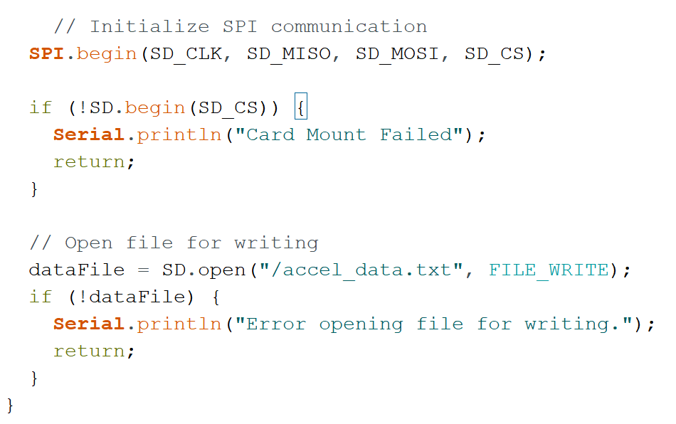
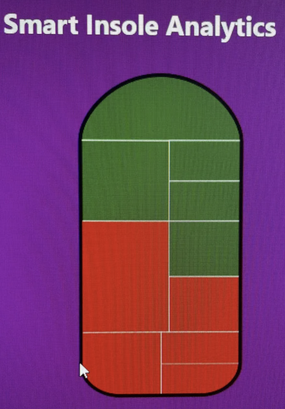
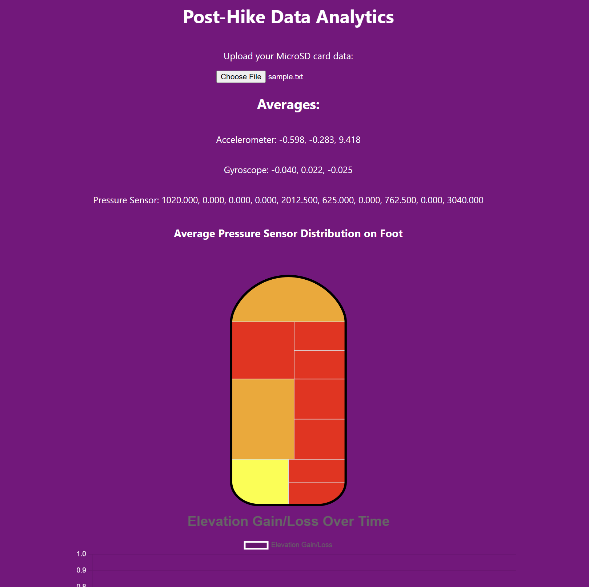

# Anthony Leapo Worklog
## Quick Access
- [Week of 2/19 - 2/25](#week-of-219---225)
- [Week of 2/25 - 3/3](#week-of-225---33)
- [Week of 3/3 - 3/9](#week-of-33---39)
- [Week of 3/17 - 3/25](#week-of-317---325)
- [Week of 3/25 - 3/31](#week-of-325---331)
- [Week of 4/1 - 4/7](#week-of-41---47)
- [Week of 4/7 - 4/15](#week-of-47---415)
- [Week of 4/15 - 4/22](#week-of-415---422)
- [Summary](#summary)

## Week of 2/19 - 2/25
Meeting w TA:
- Got some feedback on our Project Proposal, a lot of it was small mistakes that can be fixed to provide extra clarity (better labeling of the block diagram etc) 

Design Document:
- I mainly worked on the High Level Requirements, fleshing out various quantitative parts of the R/V section for a few of the subsystems, the data storage component, and the hardware design section, tolerance analysis, and filled out the parts chart.

## Week of 2/25 - 3/3
Meeting w TA:
- Had the Design Review and got asked some great questions that I had not considered before. Namely the point of waterproofing our device was brought up and I realized we have not done anything in that avenue to prevent water leakage. Also brought up a great point of making sure that our battery and tolerance calculations should be make going from (desired duration) -> (battery size) not (expected battery size) -> (desired duration), so I had to adjust my calculations accordingly (discussed later). Even though it is not expected to be a major issue, we were asked to show some calculations for the thermal element of our project as well.

PCB Design Review:
- Alyssa/Ramsey put together the initial PCB that we showed in this review and all three of us got basic pointers/tips to improve our design. I talked to a TA about making sure our battery is sufficiently above the operating threshold. For example, if the LDO regulator needs 3.3V to register as on and provide a consistent voltage, then a battery operating at 3.7V operates within a range that might not ALWAYS be above 3.3V. This would affect our duration calculations because the battery may only provide above 3.3V approximately 80% of the time, so the TA suggested either finding a higher voltage battery so that even in its inconsistent range it will be above 3.3V, or adjusted the calculations. 
- TA also shot down my original plan for the SD card which was using the adapter/helper board, wich was a flawed plan to begin with. Began researching alternatives and showed what should work of someone using a microSD connector connected to the board using only 7 pins. This needs to be fleshed out and 

## Week of 3/3 - 3/9
Meeting with TA:
- Gave us the rubrics from our design review and discussed ways we could improve for our final demos: main point of improvement was in regards to our actual presentation and its general lack of formality and requests for additional technical detail
- Walked us through what the submission process would be the PCB order, including the fact that it has to pass the audit from PCBway and the DRC

Worked on PCB Design:
- Worked with my team partners to put together the KiCad schematic and PCB board. I mainly worked on putting together the SD card storage and connector and settled upon using a physical connector that looked like this and its corresponding wiring. Reasoning was that we do not have to use the microSD adapter we were previously going to use, and the connections for this were simple and available on the Internet, wrote up the full process in our shared drive entitled "MicroSD Plan". Also outlined the microSD -> SD adapter that we will be purchasing:

- Worked with the TA to improve our ESP32WROOM schematics. This consisted of making sure each strapping pin was connected to a function, and used the sample project [here](https://courses.engr.illinois.edu/ece445/wiki/#/esp32_example/index) to help me out. Worked with Alyssa to add the new components (the Download mode, the JTAG signal source, and the message portal for the ROM) to the schematic. Also talked to a TA about implementing the USB-UART bridge with the Download mode despite us having a USB-C port to flash our microcontroller with code. Essentially decided that having both was fine since there may be issues with the USB connector, so having the tried and tested USB-UART bridge for the ESP32 was a good measure for covering our bases. 

Ordered Parts:
- I put together and placed the order for our first order of parts which should contain all of the necessary electronics, resistors, capacitors, sensors, and physical items necessary to begin development apart from the PCB. It was largely based off the hardware section we put together for the design document but I made some different choices for the MPU accelerometer and gyroscope just so that it was from a known vendor for Illinois for simplicity. The full list of what was ordered is in the shared Google Drive known as "Part Order I"

## Week of 3/17 - 3/25
Meeting with TA:
- Send in PCB for this week so that we aren't lagging behind, it needs to be up to par.
- Goal: Begin working with the parts that came in from the online order -- try sending packets using the WROOM and collecting data with the accelerometer.

Design Document:
- Implemented the changes suggested for our design document. I included extra battery calculations that reverse engineered the required capacity for our required time duration. This consisted of a basic calculation of (average current draw) * (time required for operation) = (total battery capacity)
- Implemented some changes that were requested for the High Level Requirements, fleshed out some specifics of the Subsystem R/Vs, and updated the Ethics/Safety section to account for data privacy and water leakage. For addressing water leakage we may need to invest in some gaskets or O-rings or nylon to just wrap around the full enclosure.

Preliminary code:
- Wrote some code for interfacing with the gyroscope and accelerometer.
- The gyroscope code takes in the angular velocity readings and calculates the orientation of the foot according to a global plane. A SS of the code is shown below:

- The math for this code is explicitly written, and consists of converting the angular velocity data points to an instantaneous axis of rotation and angle of rotation, and from those two constructing a rotation matrix. By doing this iteratively for each data point we can keep track of the orientation in the global plane at each step.
- I also wrote code on using the accelerometer data, I will include what I do to smooth out the data and make sure those values are accurate.

- The data postprocessing for this includes getting rid of the DC offset (which causes a peak around frequency 0), applying a rolling window average to smooth out the points, and then finding the peaks of the accelerometer data where the window of each peak is adjusted using the known sampling rate. These transformations are necessary otherwise the accelerometer data would be very noisy and hard to extract value from. 

## Week of 3/25 - 3/31
Meeting with TA:
- Try and get the PCB tested thoroughly so that it is before the fourth round order
- Individual Progress Report

React App:
- Ramsey pushed the basic version of the React App and I started working on it just to familiarize myself with React and to get some key components on there. The main part that we needed to get on there was the heatmap, and I was able to get it into our app using the visx heatmap circles. The implementation of the heatmap circles took surprisingly longer than I thought, mainly due to my unfamiliarity with React and also with the way the data is package for heatmap.
- Made some updates to the app just to make it a little prettier, center some of the graphs, and changed the way our heatmap is structured to accept data in a format that is more accurate to our type of project.

- Still waiting on the PCB order (from Order 2) to come in, they said it would be here by this week but this whole week went by without it coming in unfortunately

## Week of 4/1 - 4/7
Meeting with TA:
- Sorry about delay for the PCB
- Try planning around building the whole thing on the breadboard

Web BLE:
- Got working on the ESP32-S3 and had to update my laptop drivers to recognize the COM port
- Worked on implementing the Web BLE outlined here: [WEB BLE](https://randomnerdtutorials.com/esp32-web-bluetooth/#project-overview)
- Got communication between the ESP32-S3 and our Web app on both mine and Ramsey's laptop, which was a good step forward for the data communication.

MPU6050 Accelerometer/Gyroscope:
- Ordered a breadboard version of our MPU accelerometer/gyroscope so that we can prepare for if our PCB is good
- It took a while to achieve I2C communication between the ESP32 and Accelerometer/Gyroscope and there were two main issues: the power supplied to the MPU was inconsistent as indicated by the green light flickering so I went to the lab and soldered the pins to the board. Then I needed to adjust the pins for the I2C communication, specifically using GPIO8 for SDA and GPIO9 for SCL. 
- Then I got communication working between the MPU and the ESP32 using the Web BLE.
- I updated the web application code to accept the accelerometer measurements properly and integrated a graph that plots the accelerometer measurements in real time.

## Week of 4/7 - 4/15

Meeting w TA:
- Showed him the website and got the USB-UART Bridge C, and updated the schematic so that our PCB for the final round can go through properly

Pressure Sensor:
Worked with Alyssa to integrate our sample velostat pressure sensor with the breadboard code. It was a straightforward process of soldering the wires that connected to the copper tape to a longer wire that can be plugged into the breadboard, and then putting that wire in series with a resistor. We ran into an issue of where the the pressure sensor would too sensitive to the slightest touch, and we fixed this by using a smaller resistor size to induce the current -- using a roughly 47 ohm resistor. This was an iterative process as the voltage drop across the resistor is mapped from 0 to 4095 on the ADC channel GPIO pins on the microcontroller, and depending on the value of the resistor I used, it would go from 0 to 4095 almost immediately. I discovered that going with essentially the lowest resistance allowed for the most "variability" of the pressure. Variabiltiy in this sense is defined as exerting different amounts of pressure actually result in different voltage drops as measured by the channel, i.e. light pressure corresponds to 1000, medium pressure to 2500, and intense to 4095. Got it fully working with one pressure sensor.

## Week of 4/15 - 4/22
SD Card:
Integrated the SD card with the breadboard. This made use of the SPI communication protocol and made sure the pins would be configurable. I verified it worked by opening a directory and writing to a file and then manually checking the file on my laptop. A SS of my very initial test code is shown here:

Working with the Insole:
Extended the code and the setup to work with all ten sensors worked and had variable outputs based on the pressure exerted. Picture is included here of all ten sensors.

I also made sure that all ten pressure sensors could get the data and will send it over Bluetooth with low latency. Ramsey mentioned there may be issue with using bluetooth and all ten GPIO pins but I never ran into that issue.

Web App: I made a lot of updates to the web app where I simplified it to consist of two main modes, being the real time mode that we are used to, and also make a FileUpload page that allowed people to choose .txt files that return the average gyroscope, acceleration and temperature from the measurements. I also completely remade the heatmap with my own heatmap with its own sectioned off rectangles that serve as the areas that heat up. I will include a picture of both the new heatmap and the updated FileUpload page below. I added a graph that allows you to see the elevation gain that occurs over the course of the hike. It is a basic acceleration integration with respect tot eh polling time of the sensor. Obviously since sensor measurements are extremely noisy I smoothed out the data using a windowed average of ten sequential measurements. This gave me relatively stable data. 

Buttons/LED: I also implemented some additional functionality to satisfy the Status Subsystem with this. This consisted of a button that performed the "Start Hike" function of beginning the recording of the data to the SD card. There was also two LEDs that I implemented into the microcontroller code. One of them was an LED that indicated whether a bluetooth connection existed or not, and the other which indicated where the hike was started or not. This was to give easy to see feedback to the user and was vital to our privacy component. This code was used on both the breadboard and the microcontroller component.

Two main issues with the MPU6050 and the SD card reader for the PCB that we discovered:
    - SD card was designed with connections for SD card not microSD card in mind. So our connections are wrong but we know exactly how to fix it. the only reason why we cant just reconfigure the pins is because what should be MISO is currently set to ground. Since it is set to ground I can not just reconfigure the pins in software. 
    - MPU6050 needed extra resistors and capacitors in the SDA/SCL,VCC pins to make it work

## Summary
This was a great learning experience of a project. I wrote all the microcontroller code (both breadboard and PCB) that utilized a BLE connection, the MPU accelerometer/gyroscope interfacing, and the SD card reader, giving me experience working with I2C and SPI. I also wrote all the web app code which gave me some experience working with the REACT framework and creating a polished web app that responds in real time to new data. I also got to experiment with some of the PCB design process and messed around with sensor configuration specifically with the pressure sensors. I learned a great deal completing this project and am grateful to my team members and TAs who helped me along the way!

