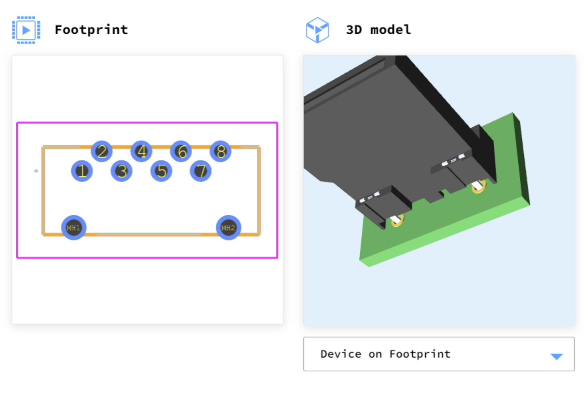
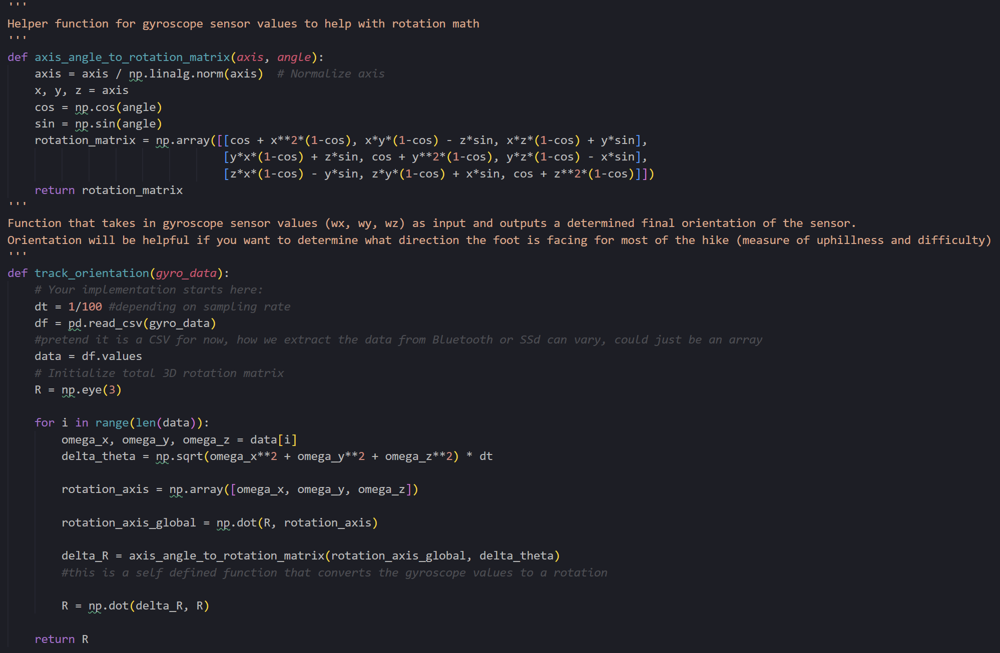
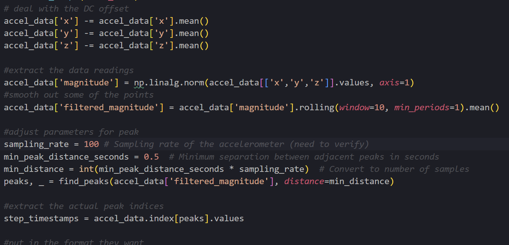

# Anthony Leapo Worklog
## Quick Access
- [Week of 2/19 - 2/25](#week-of-219---225)
- [Week of 2/25 - 3/3](#week-of-225---33)
- [Week of 3/3 - 3/9](#week-of-33---39)
- [Week of 3/17 - 3/25](#week-of-317---325)

## Week of 2/19 - 2/25
Meeting w TA:
- Got some feedback on our Project Proposal, a lot of it was small mistakes that can be fixed to provide extra clarity (better labeling of the block diagram etc) 

Design Document:
- I mainly worked on the High Level Requirements, fleshing out various quantitative parts of the R/V section for a few of the subsystems, the data storage component, and the hardware design section, tolerance analysis, and filled out the parts chart.

## Week of 2/25 - 3/3
Meeting w TA:
- Had the Design Review and got asked some great questions that I had not considered before. Namely the point of waterproofing our device was brought up and I realized we have not done anything in that avenue to prevent water leakage. Also brought up a great point of making sure that our battery and tolerance calculations should be make going from (desired duration) -> (battery size) not (expected battery size) -> (desired duration), so I had to adjust my calculations accordingly (discussed later). Even though it is not expected to be a major issue, we were asked to show some calculations for the thermal element of our project as well.

PCB Design Review:
- Alyssa/Ramsey put together the initial PCB that we showed in this review and all three of us got basic pointers/tips to improve our design. I talked to a TA about making sure our battery is sufficiently above the operating threshold. For example, if the LDO regulator needs 3.3V to register as on and provide a consistent voltage, then a battery operating at 3.7V operates within a range that might not ALWAYS be above 3.3V. This would affect our duration calculations because the battery may only provide above 3.3V approximately 80% of the time, so the TA suggested either finding a higher voltage battery so that even in its inconsistent range it will be above 3.3V, or adjusted the calculations. 
- TA also shot down my original plan for the SD card which was using the adapter/helper board, wich was a flawed plan to begin with. Began researching alternatives and showed what should work of someone using a microSD connector connected to the board using only 7 pins. This needs to be fleshed out and 

## Week of 3/3 - 3/9
Meeting with TA:
- Gave us the rubrics from our design review and discussed ways we could improve for our final demos: main point of improvement was in regards to our actual presentation and its general lack of formality and requests for additional technical detail
- Walked us through what the submission process would be the PCB order, including the fact that it has to pass the audit from PCBway and the DRC

Worked on PCB Design:
- Worked with my team partners to put together the KiCad schematic and PCB board. I mainly worked on putting together the SD card storage and connector and settled upon using a physical connector that looked like this and its corresponding wiring. Reasoning was that we do not have to use the microSD adapter we were previously going to use, and the connections for this were simple and available on the Internet, wrote up the full process in our shared drive entitled "MicroSD Plan". Also outlined the microSD -> SD adapter that we will be purchasing:

- Worked with the TA to improve our ESP32WROOM schematics. This consisted of making sure each strapping pin was connected to a function, and used the sample project [here](https://courses.engr.illinois.edu/ece445/wiki/#/esp32_example/index) to help me out. Worked with Alyssa to add the new components (the Download mode, the JTAG signal source, and the message portal for the ROM) to the schematic. Also talked to a TA about implementing the USB-UART bridge with the Download mode despite us having a USB-C port to flash our microcontroller with code. Essentially decided that having both was fine since there may be issues with the USB connector, so having the tried and tested USB-UART bridge for the ESP32 was a good measure for covering our bases. 

Ordered Parts:
- I put together and placed the order for our first order of parts which should contain all of the necessary electronics, resistors, capacitors, sensors, and physical items necessary to begin development apart from the PCB. It was largely based off the hardware section we put together for the design document but I made some different choices for the MPU accelerometer and gyroscope just so that it was from a known vendor for Illinois for simplicity. The full list of what was ordered is in the shared Google Drive known as "Part Order I"

## Week of 3/17 - 3/25
Meeting with TA:
- Send in PCB for this week so that we aren't lagging behind, it needs to be up to par.
- Goal: Begin working with the parts that came in from the online order -- try sending packets using the WROOM and collecting data with the accelerometer.

Design Document:
- Implemented the changes suggested for our design document. I included extra battery calculations that reverse engineered the required capacity for our required time duration. This consisted of a basic calculation of (average current draw) * (time required for operation) = (total battery capacity)
- Implemented some changes that were requested for the High Level Requirements, fleshed out some specifics of the Subsystem R/Vs, and updated the Ethics/Safety section to account for data privacy and water leakage. For addressing water leakage we may need to invest in some gaskets or O-rings or nylon to just wrap around the full enclosure.

Preliminary code:
- Wrote some code for interfacing with the gyroscope and accelerometer.
- The gyroscope code takes in the angular velocity readings and calculates the orientation of the foot according to a global plane. A SS of the code is shown below:

- The math for this code is explicitly written, and consists of converting the angular velocity data points to an instantaneous axis of rotation and angle of rotation, and from those two constructing a rotation matrix. By doing this iteratively for each data point we can keep track of the orientation in the global plane at each step.
- I also wrote code on using the accelerometer data, I will include what I do to smooth out the data and make sure those values are accurate.

- The data postprocessing for this includes getting rid of the DC offset (which causes a peak around frequency 0), applying a rolling window average to smooth out the points, and then finding the peaks of the accelerometer data where the window of each peak is adjusted using the known sampling rate. These transformations are necessary otherwise the accelerometer data would be very noisy and hard to extract value from. 

## Week of 3/25 - 3/31
Meeting with TA:
- Try and get the PCB tested thoroughly so that it is before the fourth round order
- Individual Progress Report

React App:
- Ramsey pushed the basic version of the React App and I started working on it just to familiarize myself with React and to get some key components on there. The main part that we needed to get on there was the heatmap, and I was able to get it into our app using the visx heatmap circles. The implementation of the heatmap circles took surprisingly longer than I thought, mainly due to my unfamiliarity with React and also with the way the data is package for heatmap.
- Made some updates to the app just to make it a little prettier, center some of the graphs, and changed the way our heatmap is structured to accept data in a format that is more accurate to our type of project.

- Still waiting on the PCB order (from Order 2) to come in, they said it would be here by this week but this whole week went by without it coming in unfortunately

## Week of 4/1 - 4/7
Meeting with TA:
- Sorry about delay for the PCB
- Try planning around building the whole thing on the breadboard

Progress:
- Got working on the ESP32-S3 and had to update my laptop drivers to recognize the COM port
- Worked on implementing the Web BLE outlined here: [WEB BLE](https://randomnerdtutorials.com/esp32-web-bluetooth/#project-overview)
- Got communication between the ESP32-S3 and our Web app on both mine and Ramsey's laptop, which was a good step forward for the data communication.
